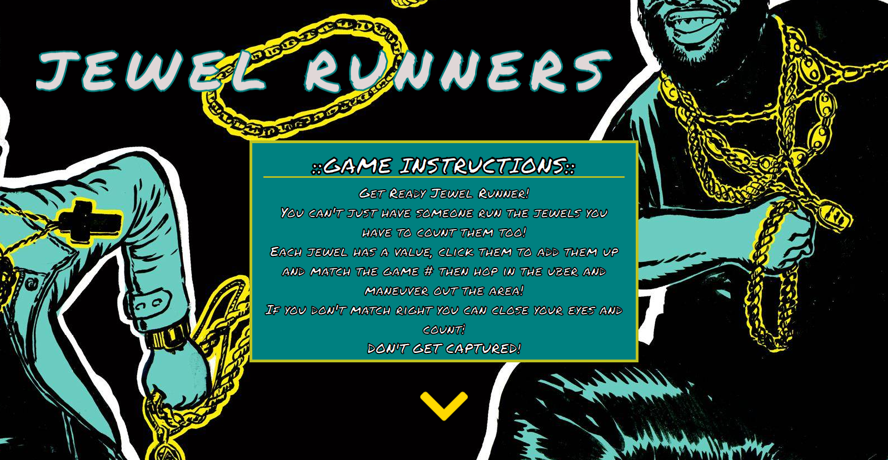
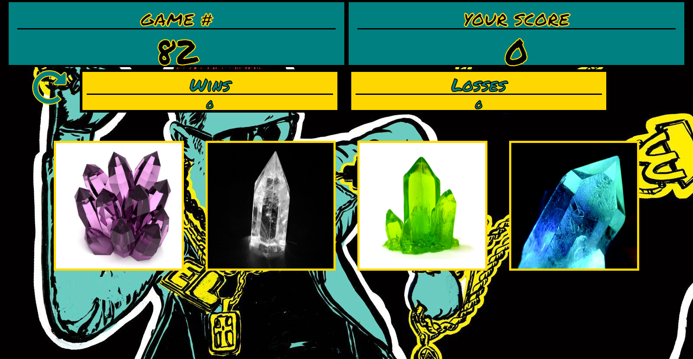

  
  
 

<h1 align="center">
Crystal Collector
</h1>

Created a game that would auto generate a random number from 19 - 120.

Player is given four jewels/crystals that are assigned a random number value between 1 and 12.

Player must click each jewel/crystal in order to add them up and try to match the random 19 - 120 generated number.

If player can they will win the game, if not they will lose.

Game will reset, after a win or lose of a round.

Won and lost rounds are displayed for the player.

## **_Hero-Section_** 

## **_Game-Section_** 

